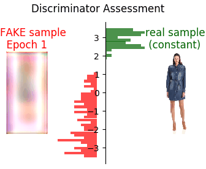

# StyleGAN2 in a Nutshell

* Best in class **GAN** for artificially synthesizing natural-looking images by means of Machine Learning 
* There are approx. 50 [pre-trained StyleGAN2](https://www.opensourceagenda.com/projects/awesome-pretrained-stylegan2) domain models available publicly
* Each StyleGAN2 domain model can synthesize endless variations of images within the respective domain
* Invented by NVIDIA 2020, see [teaser video](https://www.youtube.com/watch?v=9QuDh3W3lOY) & [source code](https://github.com/NVlabs/stylegan2-ada)
* New Version "[Alias-Free GAN](https://nvlabs.github.io/alias-free-gan/)" expected in September 2021
* Examples from [afhqwild.pkl](https://nvlabs-fi-cdn.nvidia.com/stylegan2-ada/pretrained/) and [ffhq.pkl](https://nvlabs-fi-cdn.nvidia.com/stylegan2-ada/pretrained/) model data (generated on my own implementation):

   
  

**Legal information**:
All content of "StyleGAN2 in a Nutshell" is **© 2021 [HANS ROETTGER](mailto:oss.roettger@posteo.org)**. You may use parts of it in your own publications if you mark them clearly with "source: oss.roettger@posteo.org"

## What is a GAN - Generative Adversarial Network?
* First invented at Université de Montreal in 2014 (see [evolution of GANs](https://github.com/marload/GANs-TensorFlow2))
* **Generative Network**: A **Generator** synthesizes fake objects similar to a **Training Set** (domain)
* **Adversarial**: the **Generator** and a **Discriminator** component compete each other and hence become both better and better with each optimization step in a learning process
* Even when the Generator & the Discriminator synthesize & assess totally random in the beginning, eventually the Generator will have learned to synthesize fake objects that could hardly be distinguished from the Training Set. 

  

## The StyleGAN2 Learning Process

* Needs approx. 10,000 images in the **Training Set**
* Takes a few days of computing time 
* Video below: learning process based on 11,300 fashion images fed 200 times (= "epochs") to the **Discriminator** resulting in more than 2 million optimization steps for the Discriminator and the Generator. The video shows the generated fake images after each learning epoch.

  

## The StyleGAN2 Discriminator Image ➡️ Assessment

* Reviews FAKE & real images and adjusts assessment criteria in each learning step so that FAKE images get lower results than real images (in average)
* Implemented as many other DNN regcognizers: consecutive filters (3x3 Convolutions) to generate more and more abstract image features and a dense layer in the end to map features to a scalar value
* The discriminator assessments results are neither absolute, nor constant for a unique image, but change with each learning step. The video below shows that a fixed sample of real images gets different assessment results over time as the discriminater tries to keep up with a generator getting better and better:

  

## StyleGAN2 Special Properties: z ➡️ Image

* The StyleGAN2 **Generator** synthesizes outputs based on a small input vector z "modulation“ (typical size: 2048 Bytes)
* Different values of z generate different outputs
* Therefore z could be interpreted as a very compressed representation of the synthesized output
* For almost all natural images there exists a [generating z](https://github.com/oss-roettger/HR_Encoder)
* Most important: Similar z generate similar output objects! Accordingly a linear combination of two input vectors z1 & z2 results in an output object in between the zoutputs generated by 1 & z2 

 

## The StyleGAN2 Generator in Detail

The StyleGAN2 Generator has no clue WHAT it is synthesizing (no hidden 3D geometrical model, no part/whole relationships, no lighting models, no nothing). It is just adding and removing dabs of paint, starting at a very coarse resolution and adding finer dabs in consecutive layers - similar to the wet-on-wet painting technique of [Bob Ross](https://en.wikipedia.org/wiki/Bob_Ross).

### z (mapped to w) ➡️ Image

64x64xRGBA image generator with 5 layers that has learned to generate emojis. All output layers have been normalized to visualize the full information contained (different ranges of values in reality). An other example with 7 layers: [256x256xRGB](./media/generator_ffhq.png)

* The output image is synthesized as the sum of the consecutive image layers L
* Each image layer L is a projection P of a higher dimensional data space into the desired number of image channels C
* The higher dimensional data space for each L is generated by convolution filters C1, C2 from its predecessor
* The Input vector w “modulates“ each convolution filter and the projection! (w is a mapped version of z to achieve equal distribution in image space)
* Additionally noise is added in each layer to generate more image variations. Final result of applying noise to different layers:

  L0:  L1:  L2:  L3:  L4: 

## Own Experiments & Experience
* Reimplemented StyleGAN2 from scratch to understand how it works and to eliminate some flaws of NVIDIAs reference implementation
* NVIDIA implementation flaws: outdated Tensorflow version, squared RGB Images only, proprietary & non-transparent dnnlib, mode collapse tendency, bad CPU inference
* Own Implementation: slightly slower, needs much more GPU memory, but other flaws eliminated!
* Starting point: collected and applied the pre-trained domain models available on public websites
* Training of own StyleGAN2 domain models needs high amount of computational resources and well prepared Training Sets (at least 5000 images; StyleGAN ADA claims to work with 2000 images)
* Training Sets need to have a lot of variation within but should not be too diverse. Spacial alignment is also critical, since neural networks do not cope with translations well. Upcoming  "[Alias-Free GAN](https://nvlabs.github.io/alias-free-gan/)" claims to deal better with translations and rotations

### What Training Sets Worked Well?
Catalog images and consecutive frames from video clips!

* Fashion-MNIST Model (24x24xGray, Training Set size: 6000 [source](https://github.com/zalandoresearch/fashion-mnist))

   

* Emoji Model (64x64xRGBA, Training Set size: 6620 [source](https://emojipedia.org/))

   
  
* Fashion Model (128x64xRGB, Training Set size: 11379 [source](https://vision.cs.ubc.ca/datasets/fashion/))

   
  
* Rain Drops Model (64x128xGray, 3800 images from own video clip)

  
  

### What Did Not Work?
Too much diversity in the Training Set.

* Stamp Model (48x80xRGB, 11491 images from various stamp catalogs)
  In this example StyleGAN3 learned that a stamp has pips, a small border and typical color schemes but the motifs were too divers to be learned:
  
  

### Machine Learning Development Environment

* [Tensorflow](https://www.tensorflow.org/) (Google) vs. [PyTorch](https://pytorch.org/) (Facebook); ML Abstraction Layer [Keras](https://keras.io/about/)
* Use GPU acceleration!
  - 10x Computational Power in float32 (standard for ML)
  - BUT slower than CPU in float64 (scientific applications)
  - 10x faster memory access. Get as much GPU memory as possible!
  - Slower GPU just needs more time, but if ML network does not fit into GPU memory, you can‘t use it at all. 

* My development environment
  - Ryzen 5600x (64 GB) + RTX 3060 (12 GB)
  - Tensorflow 2 in [Jupyter Notebooks](https://jupyter.org/) running in [Docker Container](https://www.docker.com/resources/what-container)
